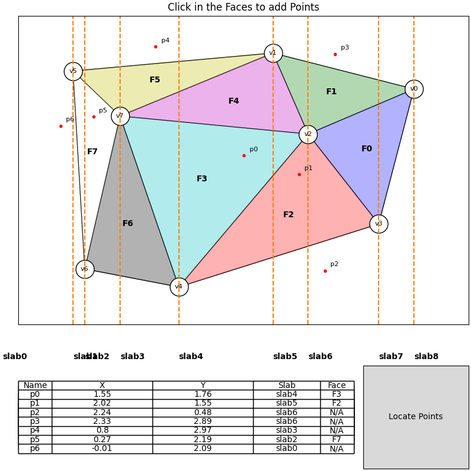

# Persistent Binary Search Tree 

Persistent binary search tree implementation in Python. This is an example of [persistent data structure](https://en.wikipedia.org/wiki/Persistent_data_structure). The implementation is based on the algorithm from [Sleator, Tarjan et al.](https://www.cs.cmu.edu/~sleator/papers/making-data-structures-persistent.pdf).

Alternatively, you can check out these [slides](https://cs.au.dk/~gerth/aa15/slides/persistent.pdf) for an overview.

With the persistent data structure, you can access the older version of the data structure. This is useful in many scenarios. Literally, you can go back in time![^1]

<div style="display: flex; justify-content: center; margin: 1em 0">
    
</div>

<!-- [^1] -->

## Prerequisites

- [Python](https://www.python.org/downloads/) 3.10 or higher.
- [GNU Make](https://www.gnu.org/software/make/), for Windows users, you can install it via [Chocolatey](https://chocolatey.org/): `choco install make`.

## Getting Started

### Installation

The package is currently not available on PyPI. You can clone the repo from GitHub:

```bash
# via https
git clone https://github.com/mactavishz/persistent-binary-search-tree.git

# via ssh
git clone git@github.com:mactavishz/persistent-binary-search-tree.git
```

### Usage

Suppose you cloned the repo under you project root directory with the name `pbst`.

### Binary Search Tree

The _normal_ binary search tree is implemented in the `lib.bst` module. The `Bst` class is the main class for the binary search tree. It has the following methods:

```python
from pbst.lib.bst import (
    Bst,
    BstNode
)
```

- `insert(key)`: insert a new node with the given key into the tree.
- `delete(key)`: delete the node with the given key from the tree.
- `search(key)`: search the node with the given key in the tree.
- `inorder(extract_key)`: traverse the tree in **inorder**. The `extract_key` flag indicates whether to extract the key from the node.
- `search_gt(key)`: search the node with the smallest key that is greater than the given key.
- `search_le(key)`: search the node with the largest key that is less than or equal to the given key.

### Partial Persistent Binary Search Tree

Partial Persistence is a weaker form of persistence. It allows us to access the older version of the data structure but not to modify it. **You can only update the data structure based on the most recent version.**

The partial persistent binary search tree is implemented in the `lib.pp_fatnode_bst` and the `lib.pp_path_copying_bst` module. Those are two different implementations but provide the same interfaces.

#### Using Fat Node Implementation

```python
from pbst.lib.pp_fatnode_bst import (
    PartialPersistentBst as PPFatNodeBst,
    FatNode as PPFatNode
)
```

#### Using Path Copying Implementation

```python
from pbst.lib.pp_path_copying_bst import (
    PartialPersistentBst as PPPathCopyingBst,
    PNode as PPPathCopyingNode
)
```

The partial persistent binary search tree has the following methods:

- `insert(keys)`: insert a new node or multiple nodes with the given key(s) into the tree.
- `delete(keys)`: delete a node or multiple nodes with the given key(s) from the tree.
- `search(key, version)`: search the node with the given key in the tree at the given version.
- `inorder(version)`: traverse the tree in **inorder** at the given version.

#### Example

```python
# You can use the fat node variant to achieve the same result.
bst = PPPathCopyingBst() # version -1
bst.insert(4) # version 0
bst.insert(1) # version 1
bst.insert(3) # version 2
bst.insert(5) # version 3
bst.delete(3) # version 4
bst.delete(1) # version 5
assert bst.search(1, 0) is None
assert bst.search(1, 1).key == 1
assert bst.inorder(5) == [4, 5]
```

### Full Persistent Binary Search Tree

Full Persistence allows us to access the older version of the data structure and even modify it. **You can update the data structure based on any version.**

Currently only the fat node variant is implemented:

```python
from pbst.lib.fp_fatnode_bst import (
    FullPersistentBst as FPFatNodeBst,
    FatNode as FPFatNode
)
```

Unlike the partial persistence, the full persistent data structure also maintains a version tree. **All the update operations will return a version**, so that you can use this version to query the data structure.

The full persistent binary search tree has the following methods:

- `insert(key, version)`: insert a new node the given key into the tree **after** the given version.
- `delete(key, version)`: delete a node with the given key from the tree **after** the given version.
- `search(key, version)`: search the node with the given key in the tree **at** the given version.
- `inorder(key, version)`: traverse the tree in **inorder** at the given version.

#### Example

```python
tree = FPFatNodeBst()
v0 = tree.insert(10) # return a version node not a version number
v1 = tree.insert(7, v0)
v2 = tree.insert(20, v1)
v3 = tree.insert(15, v2)
v4 = tree.insert(25, v3) # till now we have a linear version tree
v5 = tree.delete(7, v3)  # start branching based on v3
v6 = tree.delete(20, v4) # continue the original branch
v7 = tree.insert(30, v3) # start another branch based on v3
assert tree.search(25, v1) is None
assert tree.inorder(v4) == [7, 10, 15, 20, 25]
assert tree.search(7, v5) is None
assert tree.inorder(v5) == [10, 15, 20]
assert tree.inorder(v6) == [7, 10, 15, 25]
assert tree.inorder(v7) == [7, 10, 15, 20, 30]
assert tree.search(20, v7).key == 20
```

Be careful that number of the versions (0,1,2,3,etc.) does not correspond directly to the version. But the version node returned by the update operations do correspond directly to the version in the version tree.

It takes some time to wrap your head around this concept. You can first draw the version tree on a piece of paper and then update your version tree when you invoke any update methods.

### Unit Tests

This repo provides a comprehensive set of test cases. All test cases are located in the `tests` directory. [Pytest](https://docs.pytest.org/en/latest/) is used as the test runner.

You can run the tests with the following command:

```bash
make test
```

### Demo Application

A common use case of persistent data structure is to solve the [planar point location problem](https://en.wikipedia.org/wiki/Point_location). This repo provides a demo application that uses the partial persistent binary search tree to solve the planar point location problem using [slab decomposition](https://en.wikipedia.org/wiki/Point_location#Slab_decomposition).

The demo is implemented in the `app` directory. It uses [Matplotlib](https://matplotlib.org/) and [Networkx](https://networkx.github.io/) to let you interact with it and visualize the result.


```bash
# run the first demo
make

# run the second demo
make app2
```

#### Screenshot of the Demo



## References

[^1]: By back to the future - http://www.seeklogo.com/files/B/Back_to_the_Future-vector-logo-E8A05606FB-seeklogo.com.zip, Public Domain, https://commons.wikimedia.org/w/index.php?curid=53889429
