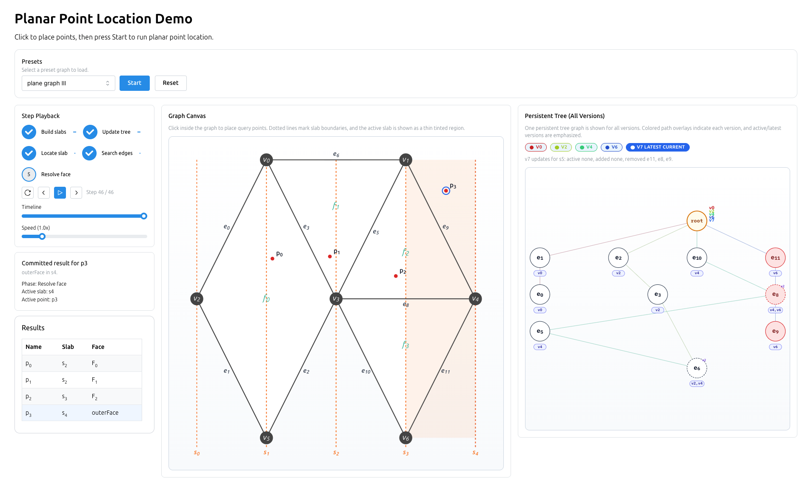

# Persistent Binary Search Tree & Planar Point Location Demo

This repository contains a TypeScript implementation of a partial persistent binary search tree and an interactive web demo for planar point location via slab decomposition.



## Why this project exists

Persistent data structures allow time-travel queries: you can inspect previous versions without losing access to the latest one. This project applies that idea to slove the planar point location problem, which is fundamental in computational geometry. The demo visualizes the construction of the slab decomposition and the point location queries, making it easier to understand how the persistent BST evolves over time.

## Tech stack

- TypeScript
- React 19
- Vite 7
- Mantine UI
- Vitest

## Getting started

### Prerequisites

- Node.js 20+
- pnpm

### Install

```bash
pnpm install
```

### Run the demo locally

```bash
pnpm dev
```

Then open the local Vite URL shown in the terminal.

### Build for production

```bash
pnpm build
```

### Preview the production build

```bash
pnpm preview
```

## Quality checks

Run tests:

```bash
pnpm test
```

Run tests once in node/jsdom environments:

```bash
pnpm test:node
pnpm test:browser
```

Type-check the project:

```bash
pnpm typecheck
```

## Demo workflow

1. Choose a preset model (`planar_1.obj`, `planar_2.obj`, `planar_3.obj`) or switch to `custom`.
2. For `custom`, paste valid OBJ content into the editor.
3. Click in the graph canvas to place one or more query points.
4. Press `Start` to build a full trace timeline.
5. Use playback controls to inspect build/query phases and tree versions.

## Core modules

- `src/persistent/*`: partial persistent BST internals and snapshots.
- `src/planar/*`: slab construction, point-location index, query tracing.
- `src/mesh/*`: mesh primitives and OBJ loader.
- `src/app/*`: visualization UI and playback logic.

## Public exports

The project re-exports the main data structures and helpers from `src/index.ts`, including:

- `PartialPersistentBinarySearchTree`
- `BinarySearchTree`
- `Mesh`, `parseObj`
- `buildSlabIndex`
- `buildPointLocationIndex`, `locatePoint`
- `meshToRenderModel`

## Minimal usage example (persistent BST)

```ts
import { PartialPersistentBinarySearchTree } from "./src/persistent/partial-persistent-bst.js";

const tree = new PartialPersistentBinarySearchTree<number>();

tree.insert([4, 1, 3, 5]); // version 0
const v1 = tree.delete(3); // version 1 (or null if not found)

console.log(tree.inorder(0)); // [1, 3, 4, 5]
console.log(tree.inorder(v1 ?? undefined)); // [1, 4, 5]
console.log(tree.search(3, 0)); // found in older version
console.log(tree.search(3)); // null in latest version
```

## Project layout

```text
public/models/            Preset OBJ graphs
src/app/                  React UI, controls, visual playback
src/persistent/           Partial persistent BST implementation
src/planar/               Slab decomposition + point location
src/mesh/                 Mesh and OBJ parsing
src/bst/                  Non-persistent BST helpers
tests/                    Unit/component tests (Vitest)
```

## References

- Persistent data structures:
  - Sleator, Tarjan et al., Making Data Structures Persistent:
        <https://www.cs.cmu.edu/~sleator/papers/making-data-structures-persistent.pdf>
- Planar point location and slab decomposition:
  - <https://en.wikipedia.org/wiki/Point_location>

## License

MIT (see `LICENSE`).
